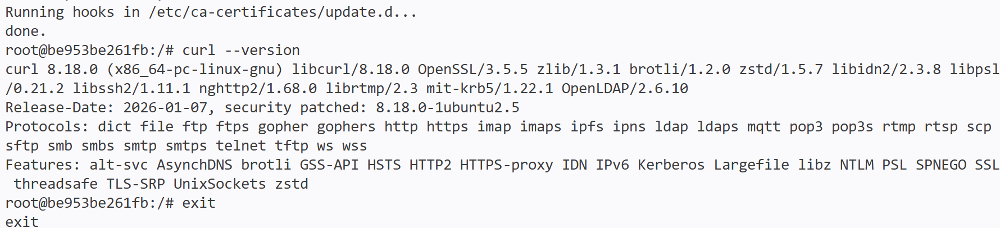
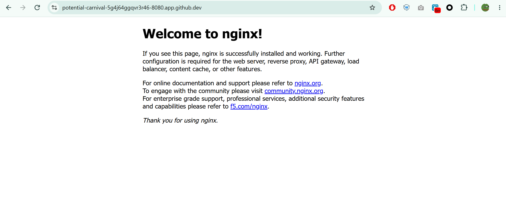
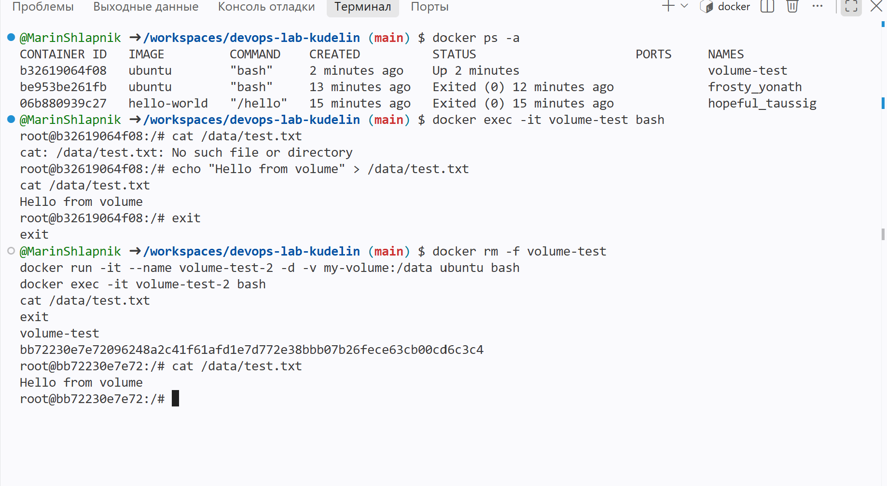
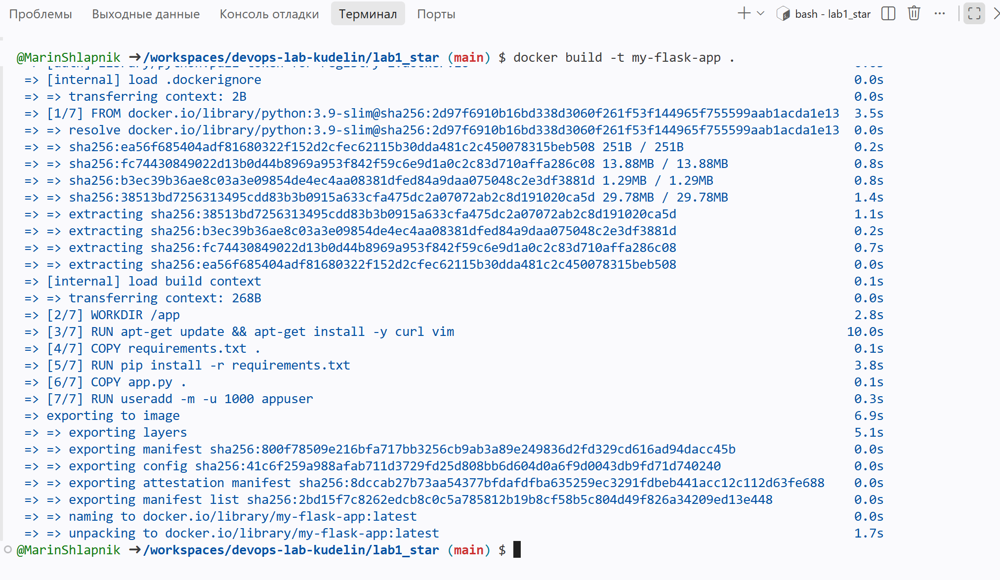
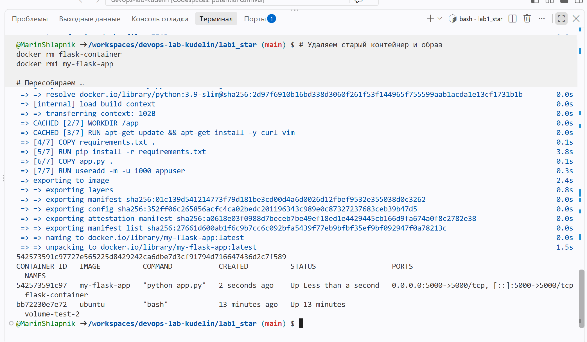

University: [ITMO University](https://itmo.ru/ru/)
Faculty: [FICT](https://fict.itmo.ru)
Course: [Введение в веб технологии](https://itmo-ict-faculty.github.io/introduction-in-web-tech/)
Year: 2026
Group: U4225
Author: Kudelin Dmitry
Lab: Lab1
Date of create: 16.09.2026
Date of finished: 16.09.2026

# Отчёт по лабораторной работе №1
## "Основы работы с Docker"

## Цель работы
Научиться работать с Docker: создавать Dockerfile, собирать образы, запускать контейнеры и управлять ими.

*Примечание: Работа выполнялась в среде GitHub Codespaces, так как локальная установка Docker Desktop на рабочем ноутбуке невозможна из-за ограничений прав администратора.*

---

## Ход работы

### 1. Изучение основ Docker

Проверка установки и запуск тестового контейнера:

docker --version
docker run hello-world

### 2. Работа с готовыми образами

## Скачивание Ubuntu и установка curl:

docker pull ubuntu:latest

docker run -it ubuntu bash

apt update && apt install -y curl

curl --version

### 3. Запуск веб-сервера Nginx

## Запуск контейнера с Nginx:

docker run -d -p 8080:80 --name web-server nginx:alpine

### 4. Работа с томами (Volumes)

## Создание тома и проверка сохранения данных:

docker volume create my-volume
docker run -it --name volume-test -d -v my-volume:/data ubuntu bash
docker exec -it volume-test bash
echo "Hello from volume" > /data/test.txt
exit

docker rm -f volume-test
docker run -it --name volume-test-2 -d -v my-volume:/data ubuntu bash
docker exec -it volume-test-2 bash
cat /data/test.txt

### 5. Лабораторная работа со звёздочкой (Dockerfile)

## Созданные файлы:

## app.py:

from flask import Flask
app = Flask(__name__)

@app.route('/')
def hello():
    return "Hello from Docker!"

if __name__ == '__main__':
    app.run(host='0.0.0.0', port=5000)

## requirements.txt:

Flask==2.0.1
Werkzeug==2.0.3

## Dockerfile:

FROM python:3.9-slim
WORKDIR /app
RUN apt-get update && apt-get install -y curl vim
COPY requirements.txt .
RUN pip install -r requirements.txt
COPY app.py .
RUN useradd -m -u 1000 appuser && chown -R appuser:appuser /app
USER appuser
EXPOSE 5000
ENV FLASK_ENV=production
CMD ["python", "app.py"]

## Сборка образа:

docker build -t my-flask-app .

## Запуск контейнера:

docker run -d -p 5000:5000 --name flask-container my-flask-app
docker ps
curl http://localhost:5000

