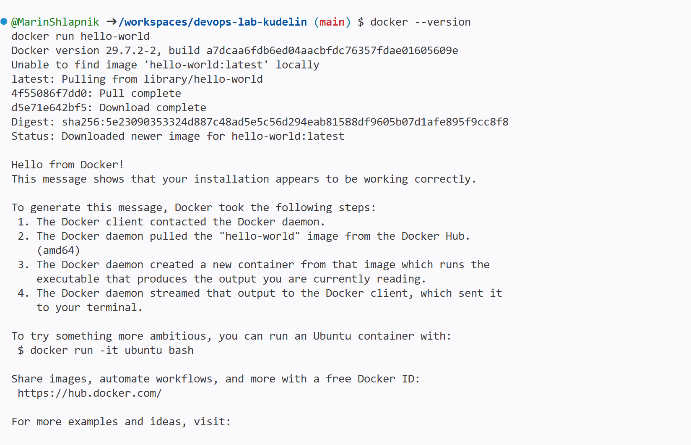

University: [ITMO University](https://itmo.ru/ru/)
Faculty: [FICT](https://fict.itmo.ru)
Course: [Введение в веб технологии](https://itmo-ict-faculty.github.io/introduction-in-web-tech/)
Year: 2026
Group: U4225
Author: Kudelin Dmitry
Lab: Lab1
Date of create: 16.09.2026
Date of finished: 16.09.2026

# Отчёт по лабораторной работе №1
## "Основы работы с Docker"

## Цель работы
Научиться работать с Docker: создавать Dockerfile, собирать образы, запускать контейнеры и управлять ими.

*Примечание: Работа выполнялась в среде GitHub Codespaces, так как локальная установка Docker Desktop на рабочем ноутбуке невозможна из-за ограничений прав администратора.*

---

## Ход работы

### 1. Изучение основ Docker

Проверка установки и запуск тестового контейнера:

```bash
docker --version
docker run hello-world



