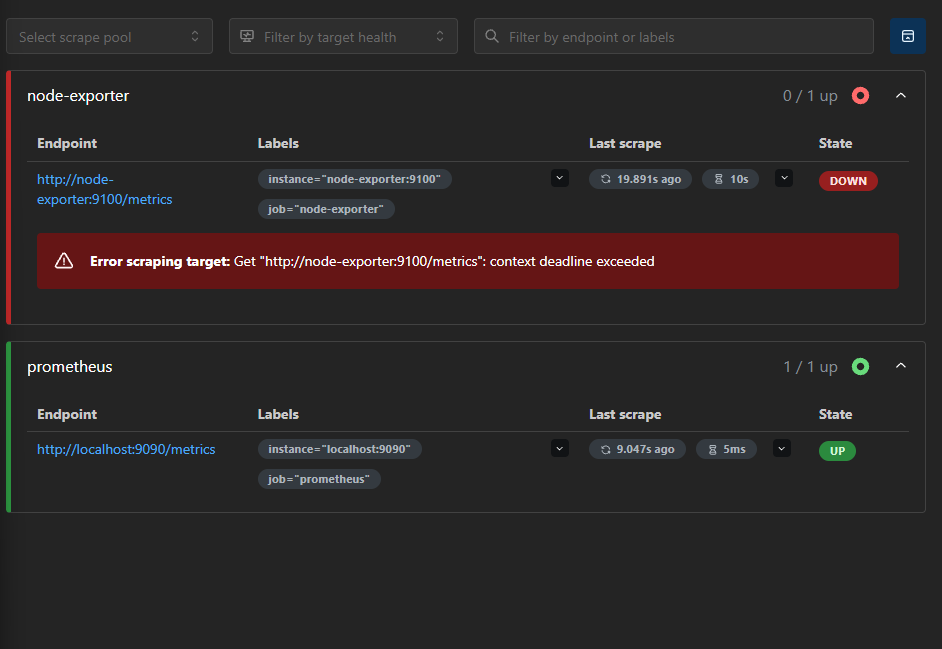
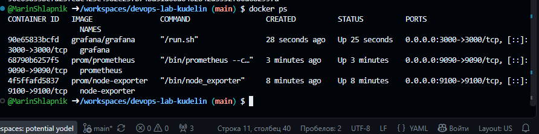
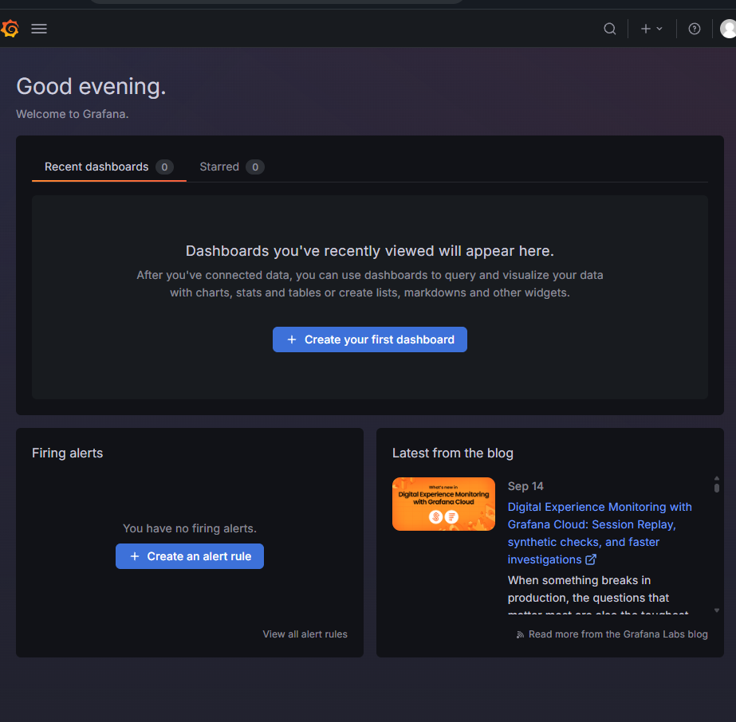
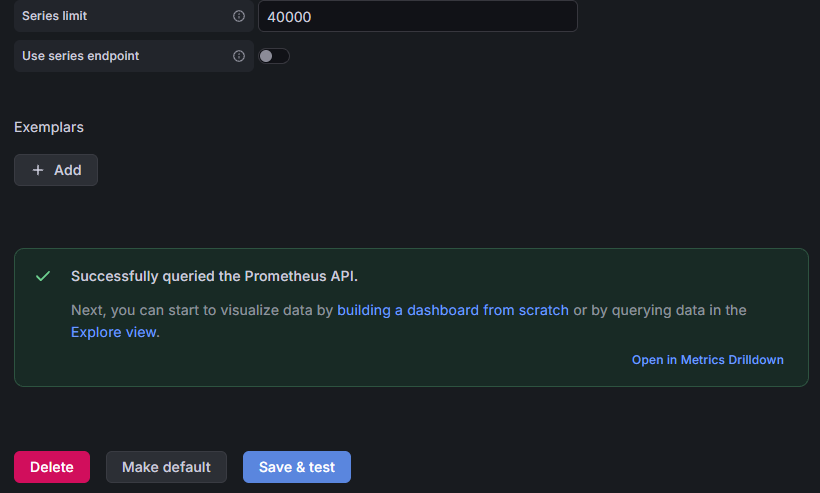
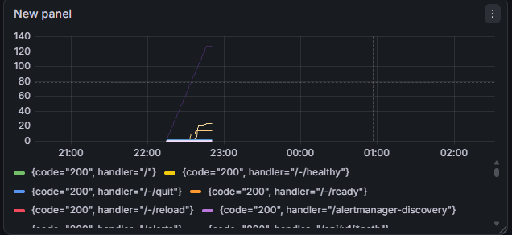

# Отчёт по лабораторной работе №3

**«Мониторинг с Prometheus и Grafana»**

---

## Информация о работе

| **Параметр** | **Значение** |
| --- | --- |
| **Университет** | [ITMO University](https://itmo.ru/ru/) |
| **Факультет** | [FICT](https://fict.itmo.ru/) |
| **Курс** | [Введение в веб технологии](https://itmo-ict-faculty.github.io/introduction-in-web-tech/) |
| **Год** | 2026 |
| **Группа** | U4225 |
| **Автор** | Kudelin Dmitry |
| **Лабораторная работа** | Lab3 |
| **Дата создания** | 16.09.2026 |
| **Дата завершения** | 16.09.2026 |

---

## Цель работы

Научиться настраивать локальную систему мониторинга с использованием Prometheus для сбора метрик и Grafana для визуализации данных, а также освоить настройку источника данных и создание дашборда.

---

## Ход работы

### 1. Подготовка конфигурации Prometheus

Работа выполнялась в основном репозитории `devops-lab-kudelin`. Для лабораторной работы была создана директория `prometheus` и файл конфигурации `prometheus/prometheus.yml`.

В конфигурации был настроен сбор метрик самим Prometheus:

```yaml
global:
  scrape_interval: 15s

scrape_configs:
  - job_name: 'prometheus'
    static_configs:
      - targets: ['localhost:9090']
```

Параметр `scrape_interval` задаёт интервал сбора метрик, равный 15 секундам.

### 2. Запуск Node Exporter

Для получения системных метрик был запущен контейнер `node-exporter`.

Работоспособность Node Exporter была проверена запросом:

```bash
curl -s http://localhost:9100/metrics | head -n 5
```

В ответ были получены метрики, например:

```text
# HELP go_gc_duration_seconds A summary of the wall-time pause (stop-the-world) duration in garbage collection cycles.
# TYPE go_gc_duration_seconds summary
go_gc_duration_seconds{quantile="0"} 0
go_gc_duration_seconds{quantile="0.25"} 0
go_gc_duration_seconds{quantile="0.5"} 0
```

Это подтвердило, что Node Exporter запущен и предоставляет метрики через HTTP-интерфейс.

В процессе работы была обнаружена проблема сетевого взаимодействия контейнеров в GitHub Codespaces: Prometheus не мог корректно разрешить имя контейнера `node-exporter`. При проверке соединения из контейнера Prometheus была получена ошибка:

```text
wget: bad address 'node-exporter:9100'
```

При этом сам Node Exporter продолжал корректно работать и отдавать метрики через `localhost:9100`.


### 3. Запуск Prometheus

Для работы Prometheus был создан Docker volume:

```bash
docker volume create prometheus-data
```

Также использовалась Docker-сеть `monitoring`.

После этого был запущен контейнер Prometheus с подключением конфигурационного файла и постоянного хранилища данных.

Работа контейнера проверялась командой:

```bash
docker ps
```

Prometheus был доступен через порт `9090`.

### 4. Проверка Prometheus

В веб-интерфейсе Prometheus был открыт раздел **Status → Targets**.

Prometheus корректно определил собственный target и отображал его со статусом `UP`.

При первоначальной настройке Node Exporter отображался со статусом `DOWN` из-за проблемы DNS-разрешения имени контейнера в среде GitHub Codespaces.

Таким образом, было установлено, что проблема связана не с работоспособностью Node Exporter, а с сетевым взаимодействием между контейнерами в используемой среде.



### 5. Запуск Grafana

Для хранения данных Grafana был создан Docker volume:

```bash
docker volume create grafana-data
```

После этого был запущен контейнер Grafana с публикацией порта `3000`.

Состояние контейнеров проверялось командой:

```bash
docker ps
```

В результате были запущены контейнеры Prometheus и Grafana.



### 6. Вход в Grafana

Веб-интерфейс Grafana был открыт через порт `3000`.

Для входа использовались учётные данные:

- **Username:** `admin`
- **Password:** `admin`

После авторизации был открыт основной интерфейс Grafana.



### 7. Настройка источника данных Prometheus

В Grafana был добавлен источник данных типа **Prometheus**.

В качестве URL сервера Prometheus был указан:

```text
http://prometheus:9090
```

После сохранения настроек была выполнена проверка подключения с помощью кнопки **Save & test**.

Grafana подтвердила успешное подключение к источнику данных сообщением:

```text
Data source is working
```



### 8. Создание дашборда

После подключения Prometheus был создан новый дашборд в Grafana.

Для визуализации использовалась метрика:

```text
prometheus_http_requests_total
```

После добавления метрики была создана панель с графиком и сохранён дашборд под названием:

```text
Prometheus Metrics
```



---

## Результаты работы

В ходе лабораторной работы была настроена система мониторинга на базе Docker, Prometheus и Grafana.

Были выполнены следующие задачи:

1. Создана конфигурация Prometheus.
2. Запущен Node Exporter и проверена выдача системных метрик.
3. Запущен Prometheus и настроен сбор собственных метрик.
4. Проверена работа Prometheus через веб-интерфейс.
5. Запущена Grafana.
6. Prometheus подключён к Grafana в качестве источника данных.
7. Создан и сохранён дашборд с визуализацией метрики.
8. Проверена работоспособность всей связки мониторинга.

В процессе выполнения была выявлена проблема сетевого взаимодействия между контейнерами в GitHub Codespaces. Имя `node-exporter` не разрешалось из контейнера Prometheus, хотя Node Exporter был доступен локально и корректно отдавал метрики. Для продолжения выполнения лабораторной работы Prometheus был настроен на self-monitoring — сбор собственных метрик. Это позволило проверить полный цикл работы Prometheus и Grafana: сбор, получение и визуализацию метрик.

---

## Выводы

В результате выполнения лабораторной работы были получены практические навыки работы с системами мониторинга Prometheus и Grafana.

Была изучена последовательность настройки мониторинга: запуск экспортера и Prometheus, проверка targets, подключение Prometheus к Grafana в качестве источника данных и создание визуального дашборда.

Также была рассмотрена диагностика проблем сетевого взаимодействия Docker-контейнеров. В частности, было установлено, что в используемой среде GitHub Codespaces контейнер Prometheus не мог разрешить имя `node-exporter`, несмотря на то, что сам Node Exporter работал корректно.

В итоге была получена рабочая связка **Prometheus + Grafana**, позволяющая собирать метрики и отображать их в виде графиков.
